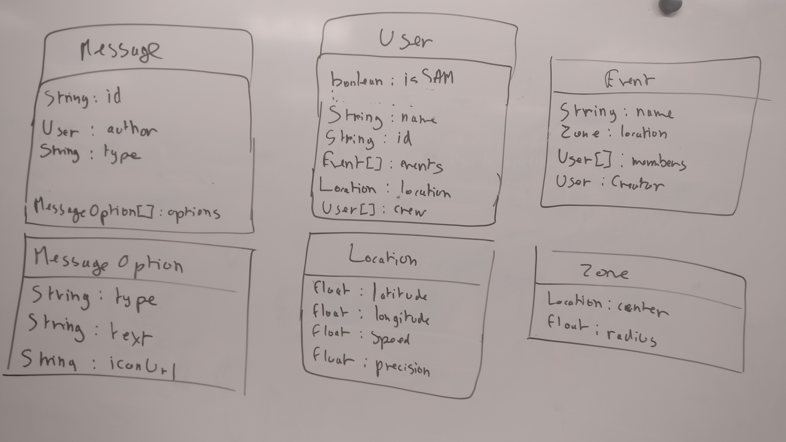

# Nuit de l'info 2017

> Le projet fil-rouge de la nuit de l'info

Basculez sur la branch `front` pour le frontend ou `back` pour le backend

## Communication

### Objets impliqués dans la communication

* `Message` : L'objet représentant un message du serveur au client
  * `id` : Une *string* identifiant le message de maniere unique
  * `type` : Une *string* représentant le type de message envoyé
    * `text` : Un message texte
    * `image` : Une image
    * `map` : Une carte
  * `options` : Un *tableau d'objet MessageOption* contenant les options de l'utilisateur a la suite de ce message
  * D'autres options en fonction du type
* `User` : Un objet représenatnt un utilisateur
  * `id` : Une *string* représentant un identifiant unique de l'utilisateur
  * `name` : Une *string* représentant le nom de l'utilisateur
  * `isSam` : Un *boolean* qui dit si l'utilisateur est SAM ou non
  * `events` : Une *Tableau d'objet Event* représentant les événements dont l'utilisateur participe
  * `location` : Un objet *Location* représentant la position actuelle de l'utilisateur
  * `crew` : Un *tableau d'objets User* représentant les autres utilisateurs de l'équipe
* `Event` : L'objet représentant un événement auxquel les utilisateurs peuvent participer
  * `name` : Une *string* représentant le nom de l'événement
  * `location` : Un objet *Zone* représentant la position de l'evenement
  * `members` : Un *tableau d'objet User* représentant les utilisateurs participant a l'evenement
  * `creator` : Un objet *User* représentant le créateur de l'evenement
* `MessageOption` : Un objet représentant une option disponible à l'utilisateur a la suite d'un message
  * `type` : Une *string* représentant l'option
  * `text` : Une *string* représentant le texte de l'option
  * `iconUrl` : Une *string* représentant l'URL absolue de l'icone à associer a l'action
  * D'autres options en fonction du type
* `Location` : Un objet représentant une position GPS
  * `latitude` : Un *Number* représentant la latitude
  * `longitude` : Un *Number* représentant la longitude
  * `precision` : Un *Number* représentant le rayon d'imprecision (en m) de la meusure
  * `speed` : Un *Number* représentant la vitesse de la meusure
* `Zone` : Un objet représentant une zone
  * `center` : Un objet *Location* représentant le centre de la zone
  * `radius` : Un *Number* représentant le rayon de la zone

### Sequence de communication

